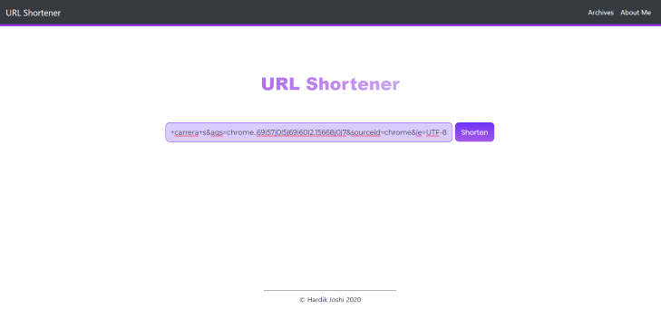
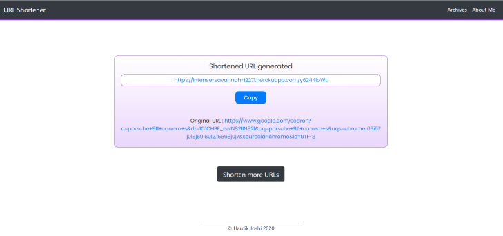
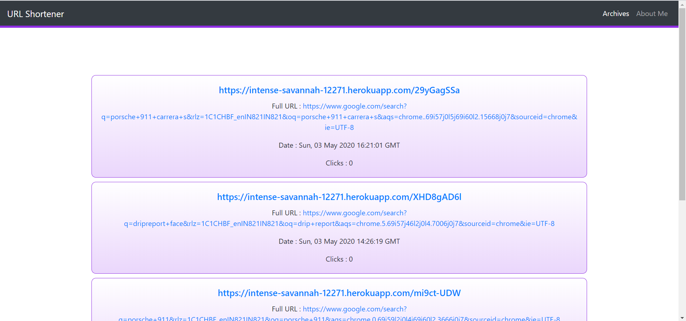

# URLShortener

URL Shortener is web app based upon Node.js, Express.js and MongoDB which shortens the long URLs into shorter ones by the use of a basURL which is the address of the URLShortener webapp. Lists of all the URLs shortened are archived and can be accessed from the archives section of the web app.

The long URL is entered to the home page : 

The shortened URL can be copied directly to the clipboard:

All the past shortened URLs can be accessed from the archives section:

